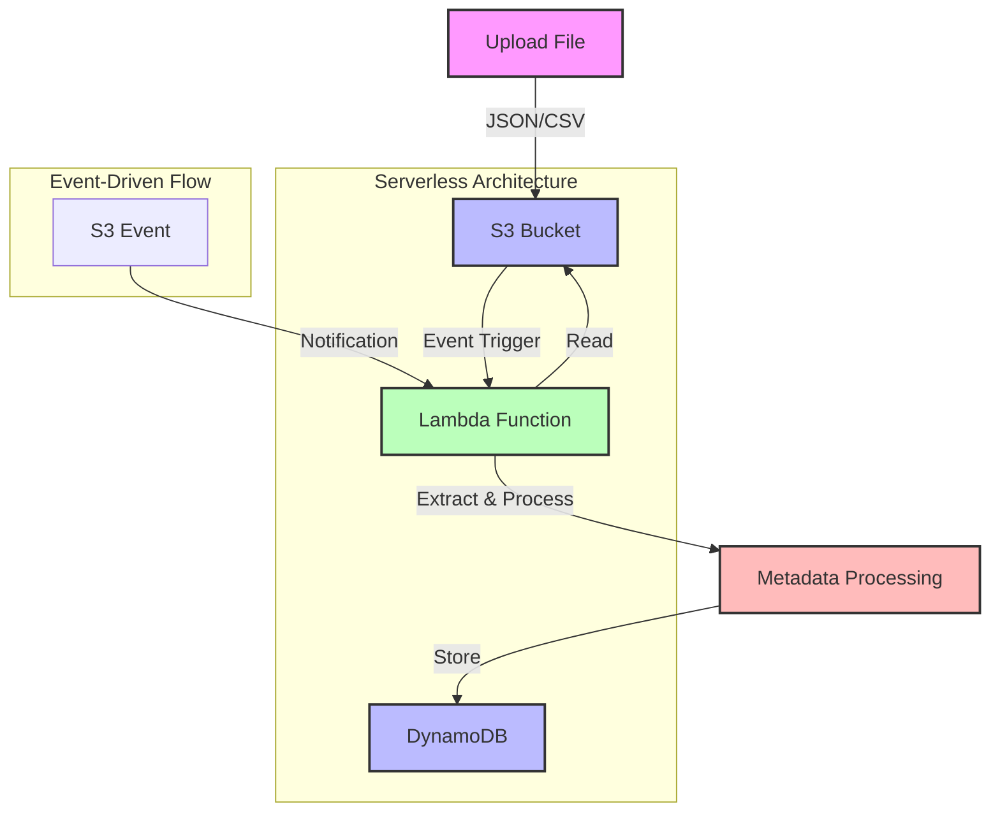
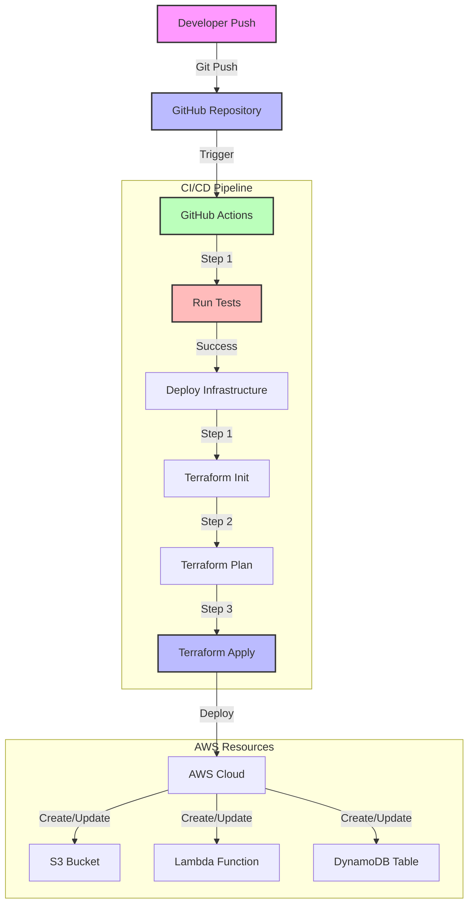

# Cloud AutoTagger

A modern serverless application that automatically extracts and stores metadata from files uploaded to S3, demonstrating key cloud architecture patterns and best practices.

## System Architecture



## CI/CD Pipeline



## 🏗️ Architecture

This project implements a serverless, event-driven architecture on AWS with the following components:

- **S3 Bucket**: Stores uploaded files (JSON/CSV)
- **Lambda Function**: Processes files and extracts metadata
- **DynamoDB**: Stores file metadata and tags
- **Event-Driven Triggers**: Automatic processing on file upload
- **Infrastructure as Code**: Using Terraform
- **CI/CD Pipeline**: Using GitHub Actions

## 🚀 Key Features

- **Automatic Metadata Extraction**: Processes files immediately upon upload
- **Format Flexibility**: Supports both JSON and CSV formats
- **Serverless Architecture**: No servers to manage
- **Real-time Processing**: Event-driven architecture
- **Infrastructure as Code**: Complete Terraform configuration
- **Automated Deployment**: GitHub Actions pipeline
- **Cost Efficiency**: Pay only for actual usage

## 💡 Modern Cloud Practices Demonstrated

### 1. Serverless Architecture
- No server management required
- Automatic scaling
- Pay-per-use pricing model
- Focus on business logic

### 2. Event-Driven Design
- S3 events trigger Lambda functions
- Loose coupling between services
- Asynchronous processing
- Real-time data flow

### 3. Infrastructure as Code (IaC)
- Terraform configuration
- Version-controlled infrastructure
- Reproducible deployments
- Environment consistency

### 4. CI/CD Best Practices
- Automated testing
- Infrastructure deployment
- Environment configuration
- Security best practices

### 5. Cloud-Native Patterns
- Managed services usage
- Stateless processing
- Document database usage
- Event-driven architecture

## 🛠️ Technical Implementation

### Lambda Function
```python
def lambda_handler(event, context):
    """
    Processes S3 events:
    1. Extracts file metadata
    2. Parses content (JSON/CSV)
    3. Stores in DynamoDB
    """
```

### DynamoDB Schema
- Primary Key: `file_id` (S)
- Sort Key: `timestamp` (S)
- Attributes:
  - `tags`: Map of extracted metadata
  - `size`: File size
  - `content_type`: File type
  - `last_modified`: Last modification time

### Infrastructure
```hcl
# Terraform configuration for:
- S3 Bucket with versioning
- Lambda function with IAM roles
- DynamoDB table
- Event notifications
```

## 🎯 Industry Relevance

This project demonstrates several key skills valued in modern cloud development:

1. **Cloud Architecture**
   - Serverless design
   - Event-driven patterns
   - Managed services usage

2. **DevOps Practices**
   - Infrastructure as Code
   - CI/CD pipelines
   - Automated testing

3. **Cloud Development**
   - AWS Lambda development
   - Event processing
   - NoSQL database usage

4. **Security Best Practices**
   - IAM roles and policies
   - Least privilege access
   - Secure configuration

## 📈 Learning Outcomes

Through this project, you gain hands-on experience with:

1. **AWS Services**
   - Lambda Functions
   - S3 Event Notifications
   - DynamoDB
   - IAM Roles and Policies

2. **Modern Development**
   - Terraform
   - GitHub Actions
   - Python Development
   - Event Processing

3. **Architecture Patterns**
   - Serverless Architecture
   - Event-Driven Design
   - Infrastructure as Code
   - CI/CD Pipelines

## 🚦 Getting Started

1. Clone the repository
2. Configure AWS credentials
3. Deploy with Terraform
4. Upload files to test

```bash
# Deploy infrastructure
cd terraform
terraform init
terraform apply

# Upload test file
aws s3 cp test.json s3://your-bucket-name/
```

## 📊 Cost Considerations

This architecture is cost-efficient because:
- Lambda: Pay only for execution time
- S3: Pay only for storage used
- DynamoDB: Pay for storage and throughput
- No ongoing server costs

## 🔍 Future Enhancements

Potential improvements could include:
1. Support for more file formats
2. Advanced metadata extraction
3. Search capabilities
4. API for metadata access
5. Real-time notifications

## 📚 Resources

- [AWS Lambda Documentation](https://docs.aws.amazon.com/lambda/)
- [Terraform AWS Provider](https://registry.terraform.io/providers/hashicorp/aws/latest/docs)
- [GitHub Actions Documentation](https://docs.github.com/en/actions)
- [Event-Driven Architecture](https://aws.amazon.com/event-driven-architecture/) 